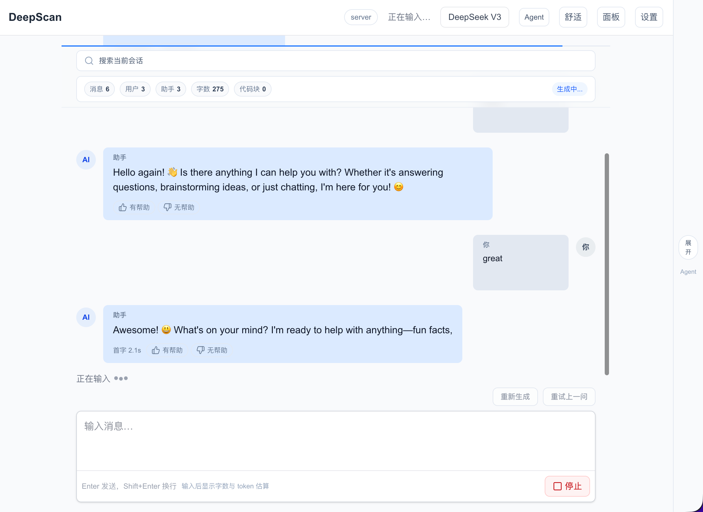
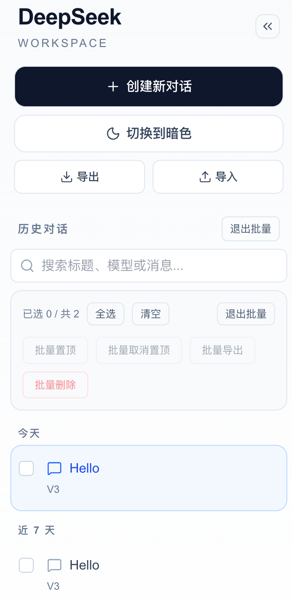
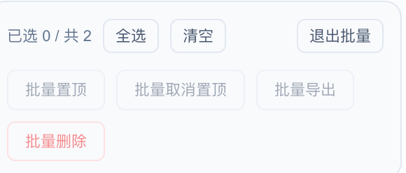
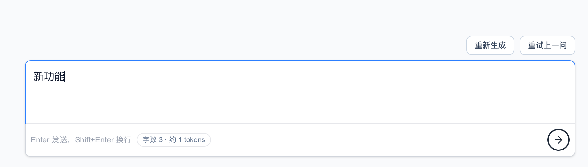
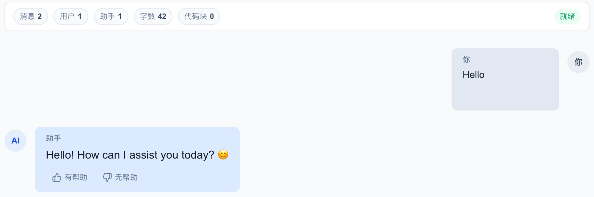
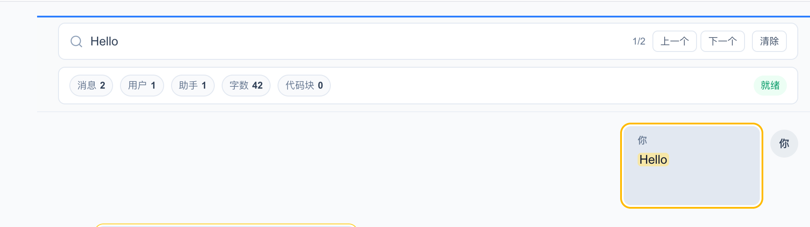
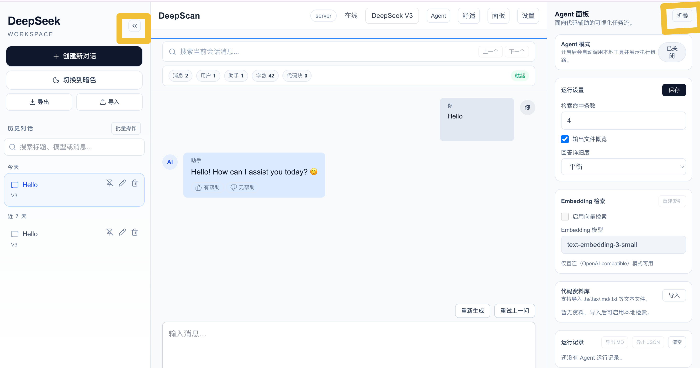
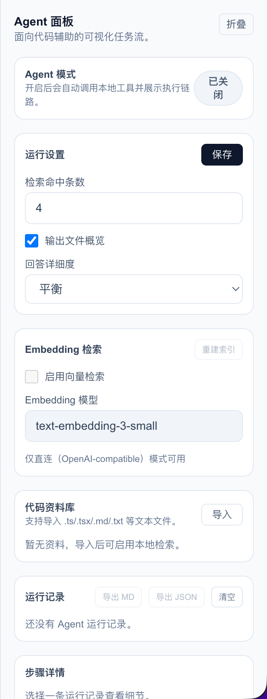
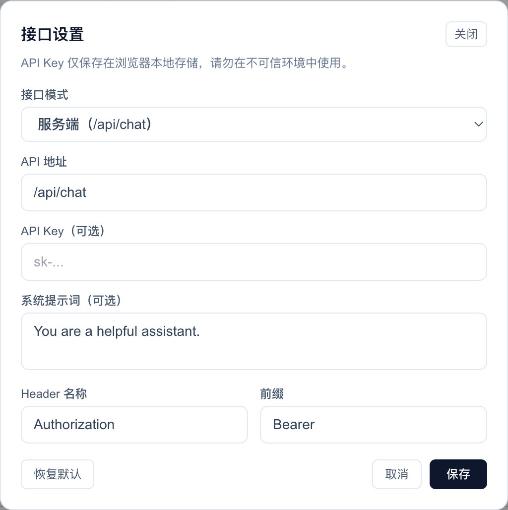

# 功能清单与展示

## 当前状态（as-is）

- 已有对话体验：发送消息、流式输出、消息渲染、代码高亮复制。
- 已有会话管理：侧边栏会话列表、搜索、置顶、重命名、删除。
- 已有会话分组：按“置顶 / 今天 / 近 7 天 / 近 30 天 / 更早”分段浏览历史。
- 已有会话迁移：支持会话 JSON 导出/导入（本地备份与恢复）。
- 已有体验增强：亮暗主题、移动端适配、侧边栏折叠。
- 已有消息操作：代码块复制 + 消息全文复制。
- 已有重试机制：支持“重试上一问”快速重新生成回答。
- 已有性能指标：展示首字耗时（TTFT）、总耗时与回复字数。
- 已有会话洞察：消息数/角色分布/字数/代码块数量概览。
- 已有快速提示：空会话提供可点击的提示词卡片。
- 已有角色标识：消息头像与角色标签增强可读性。
- 已有滚动辅助：可一键回到底部。
- 已有搜索高亮：匹配内容在消息内高亮显示。
- 已有输入提示：字数与 token 估算提示。
- 已有置顶工具栏：搜索与洞察在滚动时保持可见。
- 已有密度切换：支持“舒适/紧凑”视图。
- 已有阅读进度：滚动进度条展示会话阅读位置。
- 已有反馈按钮：对助手回复进行有帮助/无帮助标记。
- 当前仅保留模型流式聊天接口（`/api/chat`）；会话管理已前端本地化。

## 对外展示功能

### 1. 流式对话体验

即时发送消息与流式输出，保证对话反馈的连贯性与速度感。

### 2. 会话管理

侧边栏集中管理会话，支持搜索、置顶、重命名与删除，便于整理与回溯。

### 3. 会话分组浏览

按“置顶 / 今天 / 近 7 天 / 近 30 天 / 更早”分段展示，快速定位历史对话。

### 4. 会话迁移

支持 JSON 导出/导入，本地备份与恢复会话数据。

### 5. 性能指标

展示首字耗时（TTFT）、总耗时与回复字数，帮助评估模型响应效率。

### 6. 会话洞察

统计消息数、角色分布、字数与代码块数量，辅助洞察对话结构。

### 7. 搜索高亮

匹配关键词高亮显示，支持在长对话中快速定位重点信息。

### 8. 体验增强

亮暗主题、移动端适配与侧边栏折叠等细节优化，提升整体体验。

### 9. Agent 面板

### 10. 接口设置

