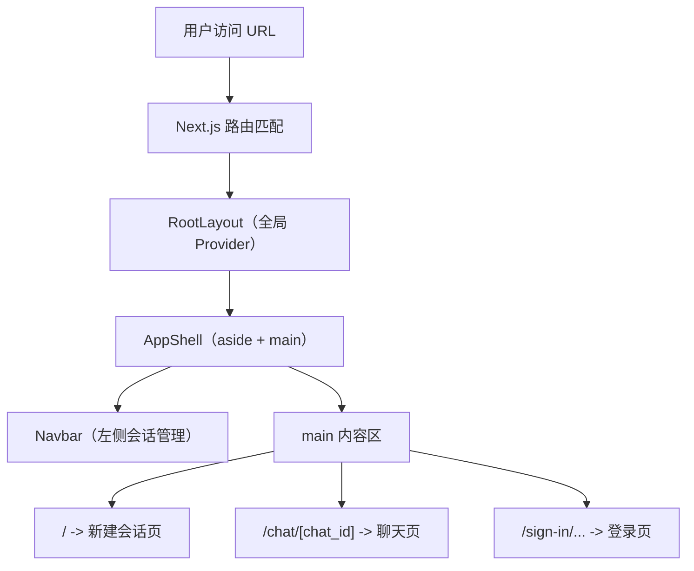
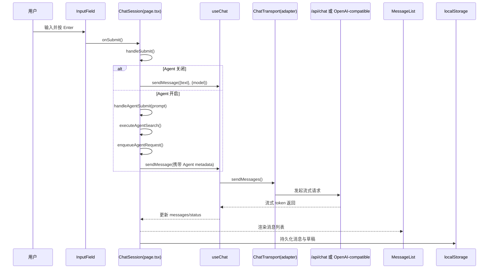
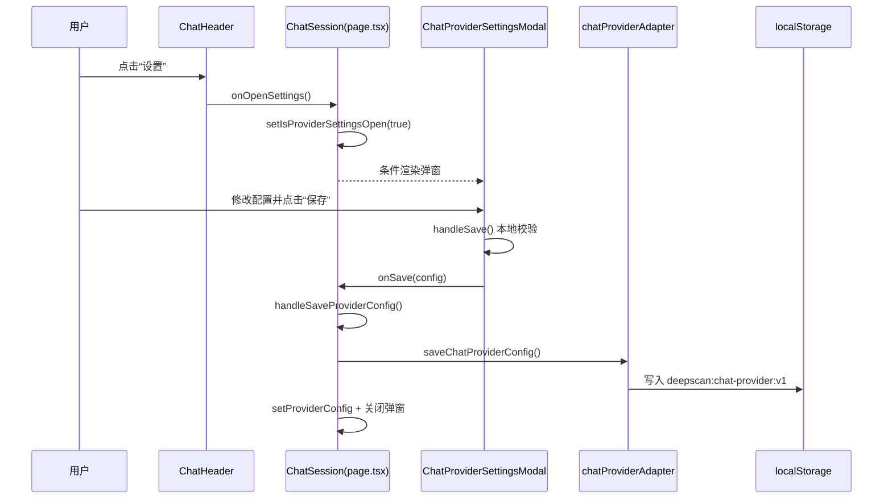
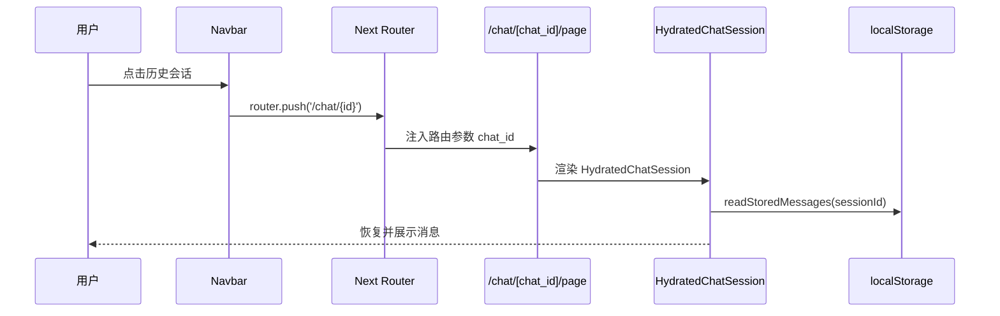

# 页面结构导览

本文面向初学者，按“页面装配 -> 消息流转 -> 弹窗交互 -> 导航跳转”的顺序理解项目。

## 1. 页面装配总览（路由 -> 外壳 -> 页面）

源码定位：
- `src/app/layout.tsx`：全局布局、主题与查询 Provider 装配。
- `src/components/AppShell.tsx`：两栏骨架（`Navbar + main`）与侧边栏折叠状态。
- `src/app/page.tsx`：首页输入后跳转 `/chat/new?...`。
- `src/app/chat/[chat_id]/page.tsx`：聊天主页面入口。
- `src/app/sign-in/[[...sign-in]]/page.tsx`：登录页面入口。

## 2. 消息发送时序（普通模式 / Agent 模式）

源码定位：
- `src/app/components/InputField.tsx`：输入、提交与停止生成按钮。
- `src/app/chat/[chat_id]/page.tsx`：`handleSubmit`、`handleAgentSubmit`、`executeAgentSearch`、`enqueueAgentRequest`。
- `src/lib/chatProviderAdapter.ts`：根据配置选择 `server` 或 `openai-compatible` 传输层。
- `src/app/api/chat/route.ts`：服务端流式代理接口。
- `src/app/components/MessageList.tsx`：消息渲染（Markdown、代码块复制、反馈等）。
- `src/lib/chatMessageStorage.ts`：会话消息本地存储键与读写。

## 3. 设置弹窗时序（接口设置）

源码定位：
- `src/app/components/ChatHeader.tsx`：顶部“设置”按钮。
- `src/app/chat/[chat_id]/page.tsx`：`isProviderSettingsOpen` 与 `handleSaveProviderConfig`。
- `src/app/components/ChatProviderSettingsModal.tsx`：弹窗 UI 与表单保存逻辑。
- `src/lib/chatProviderAdapter.ts`：Provider 配置本地持久化与加载。

## 4. 导航跳转最小链路（历史会话）

源码定位：
- `src/components/Navbar.tsx`：历史会话点击与列表操作（搜索、标签、批量）。
- `src/app/chat/[chat_id]/page.tsx`：解析 `chat_id`、生成 `sessionKey`、渲染 `HydratedChatSession`。
- `src/lib/chatStore.ts`：历史会话列表读写。
- `src/lib/chatMessageStorage.ts`：按会话存储消息。
