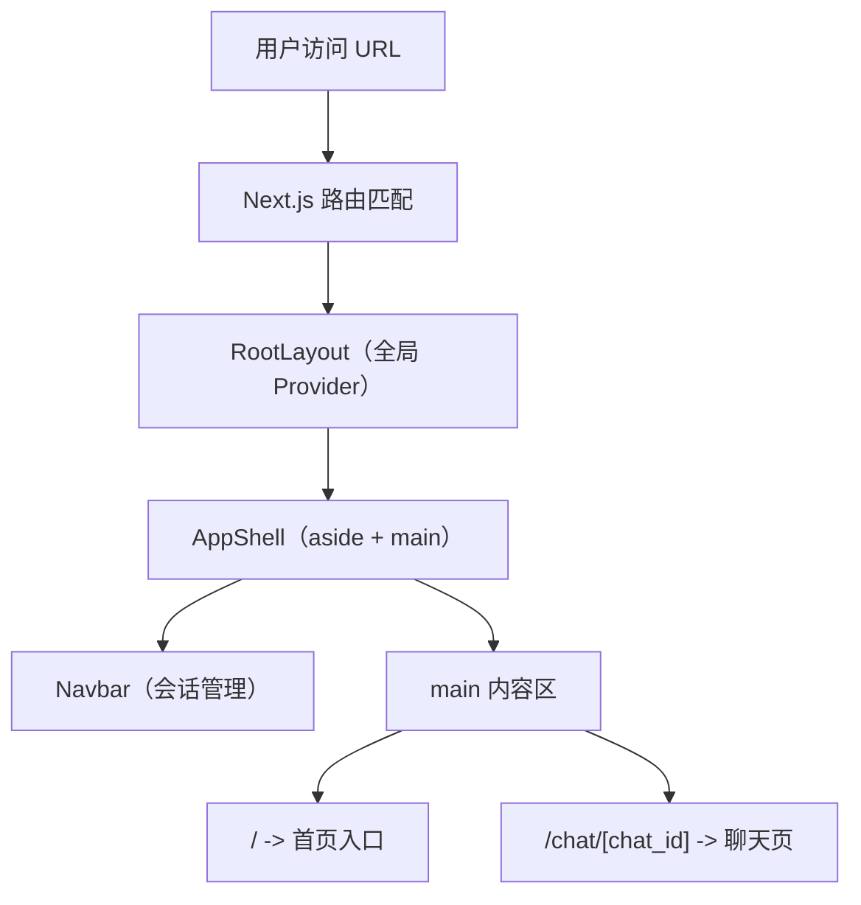
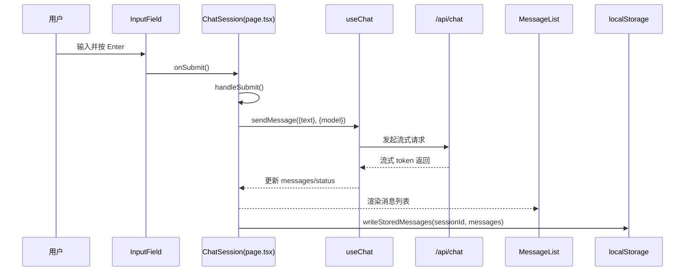
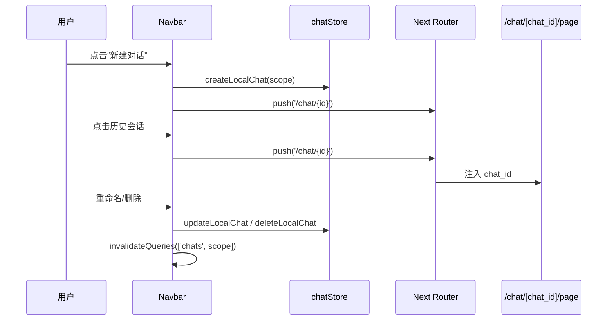

# 页面结构导览

本文按“页面装配 -> 消息流转 -> 会话导航 -> 存储落盘”四条主线说明当前实现。

## 1. 页面装配总览（路由 -> 外壳 -> 页面）

源码定位：

- `src/app/layout.tsx`：全局布局、主题与 Query Provider。
- `src/components/AppShell.tsx`：两栏骨架与侧边栏折叠状态。
- `src/app/page.tsx`：首页输入后跳转 `/chat/new?q=...`。
- `src/app/chat/[chat_id]/page.tsx`：聊天主页面入口。
- `src/proxy.ts`：请求匹配与鉴权入口。

## 2. 消息发送时序（核心聊天链路）

源码定位：

- `src/app/components/InputField.tsx`：输入、提交与停止按钮。
- `src/app/chat/[chat_id]/page.tsx`：发送逻辑、流式状态、会话创建与跳转。
- `src/app/components/MessageList.tsx`：助手/用户消息渲染与代码块复制。
- `src/app/api/chat/route.ts`：服务端流式代理。

## 3. 会话导航时序（新建/切换/重命名/删除）

源码定位：

- `src/components/Navbar.tsx`：会话列表操作。
- `src/lib/chatStore.ts`：会话元信息读写与排序。

## 4. 本地存储键与恢复逻辑

- `deepscan:chat-store`：会话列表与版本信息。
- `deepscan:chat:<sessionId>:messages`：会话消息分片。
- `deepscan:theme`：亮暗主题。
- `deepscan:sidebar-collapsed`：侧边栏折叠状态。

恢复流程：

1. 进入 `/chat/[chat_id]` 时读取会话 ID。
2. 从 `deepscan:chat:<sessionId>:messages` 拉取历史消息。
3. 渲染消息列表并继续在同一会话上下文发送。
